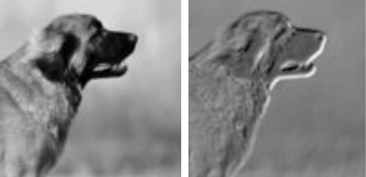

### This is a program, which applies "filters" (like the ones, you have with CNNs) to images.
Essentially, it finds out how well a certain filter fits onto an "image-patch" (an aria around a pixel).

### How does it work?
I'd recommend reading through the source code - its quite well documented.

